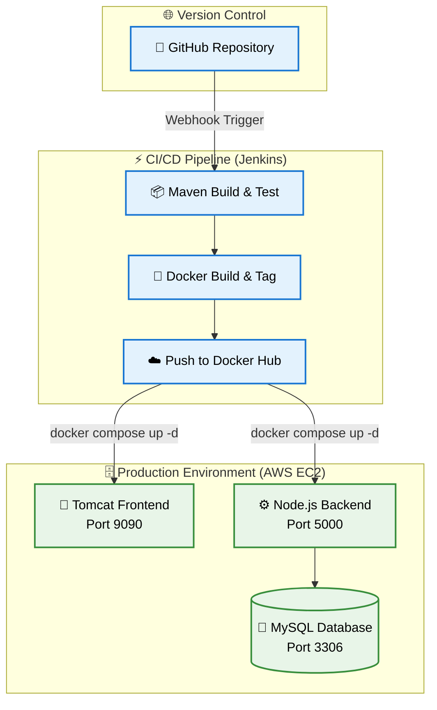

# StreamOps Pipeline / Automated Netflix Clone
_Your Tagline Here (e.g., Enterprise-Grade CI/CD Automation for Full-Stack Applications)_

[](https://www.jenkins.io/)
[](https://www.docker.com/)
[](https://aws.amazon.com/)
[](https://adoptium.net/)

> **🚀 Project Milestone** > [A brief, high-impact statement. e.g., A fully automated, zero-downtime deployment pipeline transforming raw code into a live, 3-tier streaming application architecture.]

---

## 📑 Table of Contents
1. [🎯 Project Description](#-project-description)
2. [🛠️ Problems We Solved](#️-problems-we-solved)
3. [🏗️ Architecture & Tech Stack](#️-architecture--tech-stack)
4. [🚀 How We Achieved This Project](#-how-we-achieved-this-project)
5. [⚡ Getting Started](#-getting-started)
6. [📊 Pipeline Metrics & Results](#-pipeline-metrics--results)

---

## 🎯 1. Project Description

### **The Vision**
[Provide a comprehensive overview. Explain what the application is (e.g., a scalable streaming media interface) and the infrastructure driving it. Who is this for? (e.g., "Designed to demonstrate enterprise DevOps practices for cloud engineering teams and developers seeking robust deployment patterns.")]

### **Core Capabilities**
* 🔄 **Continuous Integration:** [e.g., Automated fetching, building, and packaging of Java artifacts upon source code changes.]
* 🐳 **Container Orchestration:** [e.g., Multi-container environments managed via Docker Compose for identical dev-to-prod parity.]
* 🌐 **Dynamic Routing:** [e.g., Intelligent frontend logic that resolves API endpoints dynamically, surviving dynamic IP shifts on cloud instances.]

---

## 🛠️ 2. Problems We Solved

| The Challenge | Our Solution | The Impact |
| :--- | :--- | :--- |
| **Alert Fatigue & Manual Deployments** | Implemented a declarative Jenkins pipeline (`Jenkinsfile`) with parallel execution paths. | Reduced deployment time from [X] minutes to [Y] seconds, eliminating human error. |
| **Environment Inconsistency** | Containerized the Frontend, Backend, and MySQL database with explicit versioning and isolated networks. | "It works on my machine" is now "It works everywhere." |
| **Cgroup v2 Kernel Crashes** | Upgraded legacy base images to Eclipse Temurin (`jammy`) to support modern AWS EC2 memory management. | Achieved 100% container stability and startup reliability on modern Linux kernels. |

---

## 🏗️ 3. Architecture & Tech Stack


## 🏗️ The Stack

* **Infrastructure:** AWS EC2, Docker, Docker Hub
* **Automation:** Jenkins, Groovy (Pipeline as Code), Maven
* **Application:** Java 17, Apache Tomcat 9, Node.js, MySQL 8.0

---

## 🚀 4. How We Achieved This Project

### Phase 1: Architecture & Containerization
* **Approach:** Transitioned from bare-metal execution to a microservices mindset.
* **Execution:** Authored optimized `Dockerfiles` for the frontend and backend, utilizing multi-stage builds where necessary. Linked services using a centralized `docker-compose.yml` with persistent volume mapping for the database injection (`init.sql`).

### Phase 2: Pipeline Automation
* **Approach:** Implemented "Configuration as Code" to eliminate manual server interactions.
* **Execution:** Developed a robust `Jenkinsfile` featuring parallel image building (`failFast true`) and secure credential injection via Jenkins environment variables to authenticate with Docker Hub.

### Phase 3: Cloud Deployment & Networking
* **Approach:** Ensure secure, dynamic accessibility over the public internet.
* **Execution:** Provisioned an AWS EC2 instance, configured Security Groups for selective port exposure, and refactored frontend JavaScript to dynamically resolve the host IP, ensuring the API connection remains stable across instance reboots.

---

## ⚡ 5. Getting Started

### Prerequisites
* Docker & Docker Compose installed
* Port `9090` and `5000` available on your host/EC2 instance

### Quick Spin-Up

```bash
# 1. Clone the repository
git clone [https://github.com/yourusername/your-repo.git](https://github.com/yourusername/your-repo.git)

# 2. Navigate to the directory
cd your-repo

# 3. Launch the environment in detached mode
docker compose up -d

# 4. Verify containers are running
docker ps
```
**Access the application live at http://localhost:9090 (or your EC2 Public IP).**
