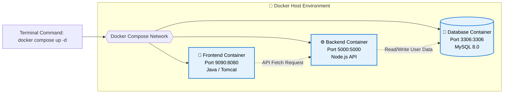
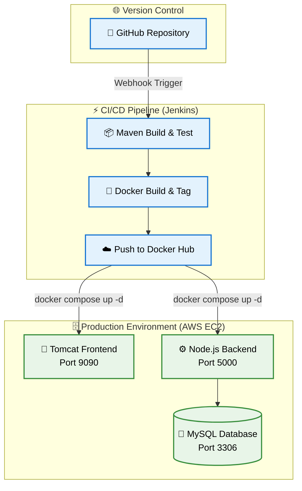

# 📦 Monolith to Microservices: A Hands-on Journey with Docker & Jenkins

[](https://www.jenkins.io/)
[](https://www.docker.com/)
[](https://aws.amazon.com/)
[](https://adoptium.net/)

---

## 📑 Table of Contents
1. [🎯 Project Description: A Journey into Containerization](#-project-description)
2. [🐳 The Containerization Strategy (How & Why)](#️-problems-we-solved)
3. [🏗️ Architecture & Tech Stack](#️-architecture--tech-stack)
4. [🚀 How We Achieved This Project](#-how-we-achieved-this-project)
5. [⚡ Getting Started](#-getting-started)
6. [📊 Pipeline Metrics & Results](#-pipeline-metrics--results)

---

## 🎯 1. Project Description: A Journey into Containerization

This project isn't just about building a Netflix clone—it serves as my personal, hands-on laboratory for mastering **Docker, microservices, and CI/CD automation**. I utilized a basic full-stack Netflix mock application as a "guinea pig" to learn how to break down a monolithic application into isolated, deployable containers.

By containerizing this application, I shifted my focus from *writing* code to *shipping* code reliably across any environment.

---

## 🐳 2. The Containerization Strategy (How & Why)

To truly understand microservices, I split the application into distinct environments, requiring separate Docker configurations.

### **The Dockerfiles**
Instead of cramming everything into one server, I wrote two separate `Dockerfile` configurations to isolate the environments:
1.  **Frontend (Root Directory):** I created a Dockerfile using `tomcat:9-jre17-temurin-jammy` as the base image. **Why?** The frontend is a compiled Java `.war` artifact. It requires a specific Java Runtime Environment and an Apache Tomcat server to host the web pages. Using the `jammy` tag was a crucial learning moment to ensure modern memory management (`cgroup v2`) compatibility on cloud instances.
2.  **Backend (`/backend` Directory):** I created a separate Dockerfile using a lightweight `node:alpine` image. **Why?** The backend is a completely different tech stack (JavaScript/Node.js). By isolating it, the Node API runs independently of the Java frontend, meaning if the frontend crashes, the backend API stays alive.

### **Orchestration with `docker-compose.yml`**
Managing multiple standalone containers manually via the terminal is prone to errors. I wrote a `docker-compose.yml` file to act as the "conductor" for the containers. This taught me how to:
* **Map Ports:** Bridging the host machine to the containers (e.g., exposing the isolated Tomcat port `8080` to the public port `9090`).
* **Manage Dependencies:** Using `depends_on` to ensure the Node.js backend waits for the MySQL database to start before trying to connect.
* **Persist Data:** Utilizing volumes to map my local `init.sql` file directly into the MySQL container's entry point, automating the database setup on boot.

### **Container Architecture Diagram**


## 🏗️ 3. Architecture & Tech Stack


## 🏗️ The Stack

* **Infrastructure:** AWS EC2, Docker, Docker Hub
* **Automation:** Jenkins, Groovy (Pipeline as Code), Maven
* **Application:** Java 17, Apache Tomcat 9, Node.js, MySQL 8.0

---

## 🚀 4. How We Achieved This Project

### Phase 1: Architecture & Containerization
* **Approach:** Transitioned from bare-metal execution to a microservices mindset.
* **Execution:** Authored optimized `Dockerfiles` for the frontend and backend, utilizing multi-stage builds where necessary. Linked services using a centralized `docker-compose.yml` with persistent volume mapping for the database injection (`init.sql`).

### Phase 2: Pipeline Automation
* **Approach:** Implemented "Configuration as Code" to eliminate manual server interactions.
* **Execution:** Developed a robust `Jenkinsfile` featuring parallel image building (`failFast true`) and secure credential injection via Jenkins environment variables to authenticate with Docker Hub.

### Phase 3: Cloud Deployment & Networking
* **Approach:** Ensure secure, dynamic accessibility over the public internet.
* **Execution:** Provisioned an AWS EC2 instance, configured Security Groups for selective port exposure, and refactored frontend JavaScript to dynamically resolve the host IP, ensuring the API connection remains stable across instance reboots.

---

## ⚡ 5. Getting Started

### Prerequisites
* Docker & Docker Compose installed
* Port `9090` and `5000` available on your host/EC2 instance

### Quick Spin-Up

```bash
# 1. Clone the repository
git clone [https://github.com/yourusername/your-repo.git](https://github.com/yourusername/your-repo.git)

# 2. Navigate to the directory
cd your-repo

# 3. Launch the environment in detached mode
docker compose up -d

# 4. Verify containers are running
docker ps
```
**Access the application live at http://localhost:9090 (or your EC2 Public IP).**

## 📸 6. Project Showcase & Visual Proof
### 🎥 Live CI/CD Pipeline Demonstration
*(Click the image below or watch the embedded video to see the pipeline in action)*

https://github.com/user-attachments/assets/d51dd255-d92b-4a5e-8254-1518c5208d1c

**What happens in this demo:**
1. **Trigger:** A developer modifies the frontend code in the repository (changing the header from "Trending Now" to "Top Picks for You").
2. **Automation:** The commit instantly triggers the Jenkins pipeline.
3. **Parallel Execution:** Jenkins compiles the Java artifact and utilizes multiple executors to build and push the Frontend and Backend Docker images to Docker Hub simultaneously.
4. **Zero-Downtime Deployment:** The EC2 instance pulls the latest `parte15/netflix-frontend:7` image and redeploys the containers.
5. **Live Result:** The live production site on AWS dynamically updates without manual server intervention.

---

### 🖥️ Application Interface


* **Secure Authentication (Left):** The custom login gateway routing credentials to the containerized Node.js backend.
* **Dynamic Frontend (Right):** The fully rendered Tomcat application successfully fetching and displaying the media catalog over the public internet on port `9090`.

---

### ☁️ Cloud Infrastructure & Container Orchestration


* **AWS EC2 Provisioning (Left):** The underlying infrastructure hosted on an AWS `t3.medium` instance, configured with custom Security Groups to expose the required application ports.
* **Containerized Database Management (Right):** Direct terminal access showing the orchestration of three interconnected containers (`frontend`, `backend`, `db`). The terminal also demonstrates a secure interactive session into the MySQL container, verifying that the `init.sql` script successfully seeded the database with user credentials.

---

### ⚙️ Automated Jenkins Pipeline & Parallel Execution


* **Declarative Pipeline as Code:** The entire build, test, and deployment lifecycle is managed by a highly structured `Jenkinsfile` stored directly in the version control system.
* **Build Optimization (Parallelization):** As seen in the *Build & Push Docker Images* stage, the pipeline splits into concurrent execution threads. The Frontend and Backend Docker images are built and pushed to Docker Hub simultaneously, significantly reducing the total pipeline run time and optimizing EC2 compute resources.
* **Continuous Delivery:** The final *Deploy Containers* stage automatically pulls the newly tagged images and dynamically injects them into the running Docker Compose environment with zero manual intervention.

### 🗄️ Peeking Inside the Container Matrix


A critical part of my containerization journey was learning that containers are fully isolated environments. I couldn't just open a local database GUI to see my users; I had to learn how to "step inside" the running container on the AWS server to verify my data. 

This screenshot demonstrates my live debugging and verification flow:

1. **Network Verification (`docker ps -a`):** First, I verified that all three microservices (Frontend, Backend, DB) were actively running and that my `docker-compose.yml` had successfully bridged the internal container ports to the external EC2 host ports.
2. **Breaching the Container (`docker exec`):** I used the `exec` command to open an interactive bash shell directly inside the isolated MySQL container (`81bde3db36ab`).
3. **Data Validation:** Once inside the container, I logged into the MySQL monitor to manually run a query. This proved that my `init.sql` volume mapping worked perfectly, seeding the database with the `admin@netflix.com` credentials right on boot!

**The exact command flow used in the terminal:**
```bash
# 1. Identify the running containers and ports
root@ip-172-31-37-40:~# docker ps -a

# 2. Drop into the database container's interactive shell
root@ip-172-31-37-40:~# docker exec -it 81bde3db36ab bash

# 3. Log into MySQL and query the seeded user data
bash-5.1# mysql -u root -pnetflix_pass
mysql> USE netflix_db;
mysql> SELECT * FROM users;
```
